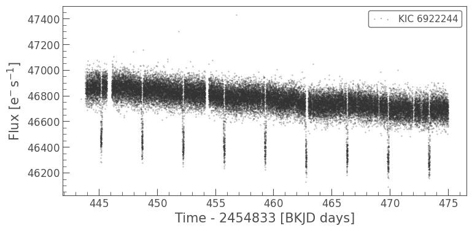
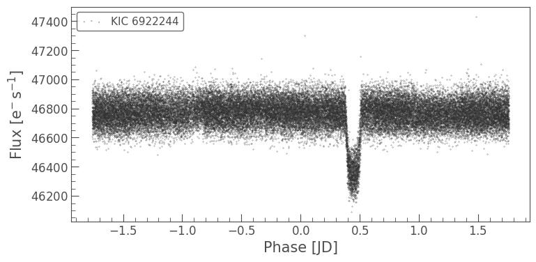
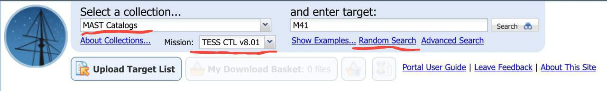

# Pathfinder

Pathfinder is an AI agent designed to identify exoplanets using deep learning. It is built upon the foundational work described in the article "Identifying Exoplanets with Deep Learning III: Automated Triage and Vetting of TESS Candidates." This agent employs a deep neural network (DNN) to analyze data from the Transiting Exoplanet Survey Satellite (TESS) mission. Pathfinder searches the Mikulski Archive for Space Telescopes (MAST) and processes Target Pixel Files to detect exoplanets in other star systems in real time.

Upon the discovery of a new exoplanet, Pathfinder generates two plots and shares them on X (formerly Twitter). The first image is a lightcurve, which depicts the variations in light intensity of the observed celestial object: 



The second image is a folded version of the lightcurve with a specified period to highlight periodic signals:




## Make Your Own Discovery

This repository includes a [user-friendly Jupyter Notebook](https://colab.research.google.com/github/pathfinder-agent/pathfinder/blob/master/searchyourself.ipynb) that enables you to search for exoplanets and other intriguing phenomena in our universe. To begin, visit the [MAST Portal](https://mast.stsci.edu/portal/Mashup/Clients/Mast/Portal.html). In the top-left dropdown menu, select "MAST Catalogs," and then choose "TESS CTL v8.01" from the subsequent dropdown. Click on "Random Search" and copy the TIC ID of the object you wish to explore.
 

Paste this ID into the following line of code within the Jupyter Notebook:
```python
tic_id = "TIC [your ID here]"
```

For instance, if you selected TIC ID 49244039, your code should look like this:
```python
tic_id = "TIC 49244039"
```

Execute the first three sections of the Jupyter Notebook in sequence. If the list generated after the third section is not empty, proceed to execute the remaining sections in consecutive order.

Should you discover something noteworthy, feel free to share it with us on our X account. We would love to see your findings!

## Acknowledgments

This project incorporates code from the following repository: [Astronet-Vetting](https://github.com/yuliang419/Astronet-Vetting).

The foundational research is credited to Yu, L. et al. (2019) in their work titled "Identifying Exoplanets with Deep Learning III: Automated Triage and Vetting of TESS Candidates," published in *The Astronomical Journal*, Volume 158, Issue 1, Article 25. The full text is accessible [here](http://iopscience.iop.org/article/10.3847/1538-3881/aa9e09/meta).